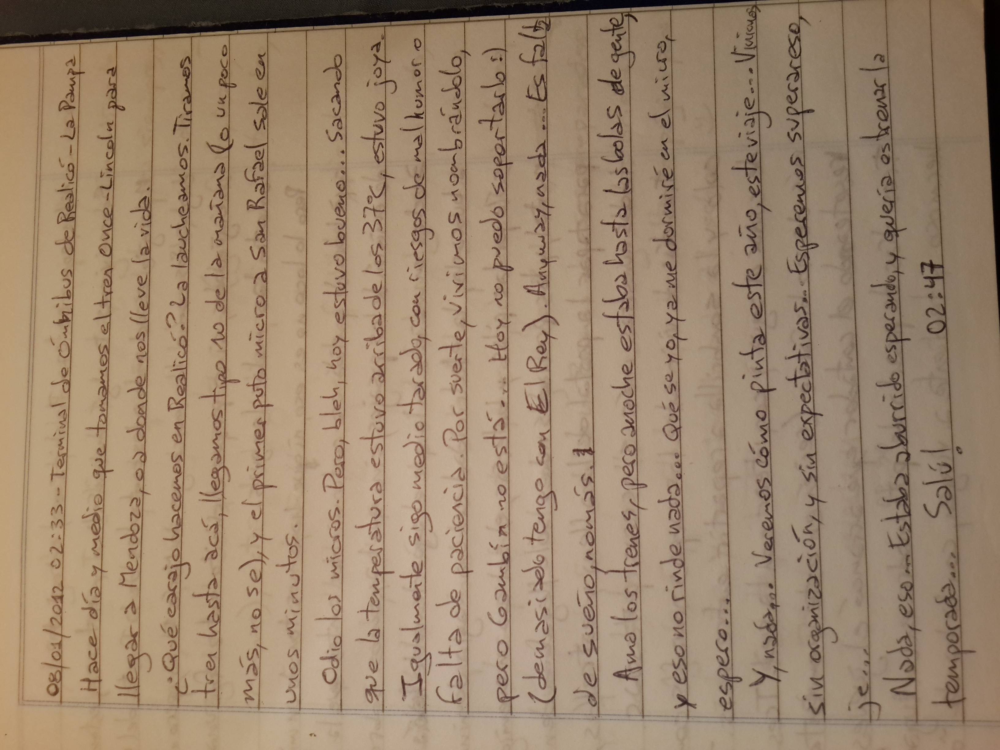

08/01/2012 02:33 - Terminal de Ómnibus de Realicó - La Pampa

Hace día y medio que tomamos el tren Once-Lincoln para llegar a Mendoza, o a donde nos lleve la vida.

¿Qué carajo hacemos en Realicó? La laucheamos. Tiramos tren hasta acá, llegamos tipo 10 de la mañana (o un poco más, no sé), y el primer puto micro a San Rafael sale en unos minutos.

Odio los micros. Pero, bleh, hoy estuvo bueno... Sacando que la temperatura estuvo arriba de los 37ºC, estuvo joya. Igualmente sigo medio tarado, con riesgos de mal humor o falta de paciencia. Por suerte, vivimos nombrándolo, pero Gambín no está... Hoy no puedo soportarlo :) (demasiado tengo con El Rey). Anyway, nada... Es falta de sueño, nomás.

Amo los trenes, pero anoche estaba hasta las bolas de gente, y eso no rinde nada... Qué se yo, ya me dormiré en el micro, espero...

Y, nada... Veremos cómo pinta este año, este viaje... Vinimos sin organización, y sin expectativas... Esperemos superar eso, je...

Nada, eso... Estaba aburrido esperando, y quería estrenar la temporada... Salú! 02:47

----

