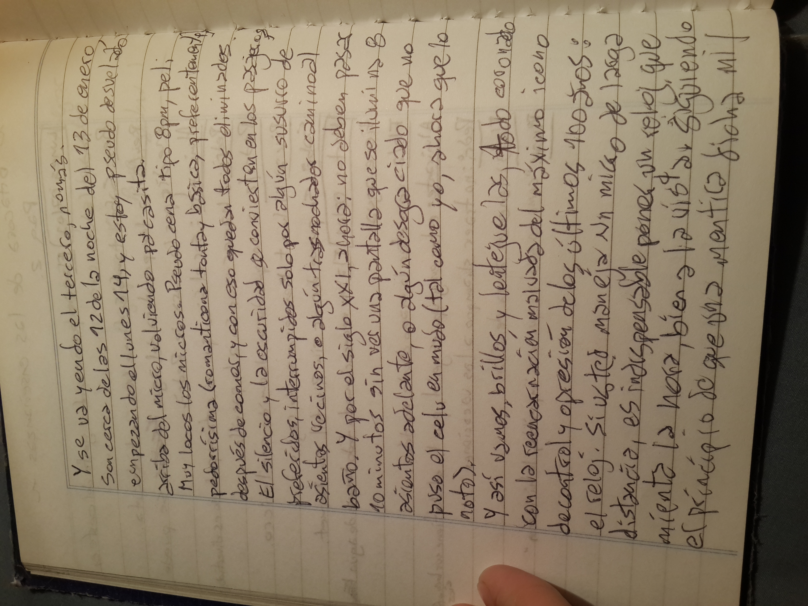
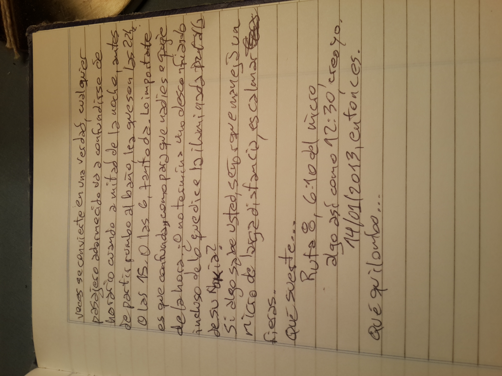

Y se va yendo el tercero, nomás.

Son cerca de las 12 de la noche del 13 de enero, empezando el lunes 14, y estoy pseudo desvelado arriba del micro, volviendo pa'casita.

Muy locos los micros. Pseudo cena tipo 8pm, peli pedorrísima (romanticona tonta y básica, preferentemente) después de comer, y con eso quedan todos eliminados. El silencio y la oscuridad se convierten en los pasajeros preferidos, interrumpidos solo por algún susurro de asientos vecinos, o algún trasnochador camino al baño. Y por el siglo XXI, ahora: no deben pasar 10 minutos sin ver una pantalla que se ilumina 8 asientos adelante, o algún desgraciado que no puso el celu en mudo (tal como yo, ahora que lo noto).

Y así vamos, brillos y lentejuelas, todo coronado con la reencarnación malvada del máximo ícono de control y opresión de los últimos 100 años: el reloj. Si usted maneja un micro de larga distancia, es indispensable poner un reloj que mienta la hora, bien a la vista. Siguiendo el principio de que una mentira dicha mil veces se convierte en una verdad, cualquier pasajero adormecido va a confundirse de horario cuando a mitad de la noche, antes de partir rumbo al baño, lea que son las 22hs. O las 15. O las 6, tanto da. Lo importante es que confunda, como para que nadie se queje de la hora. ¿O no termina uno desconfiando incluso de lo que dice la iluminada pantalla de su Nokia?

Si algo sabe usted, señor que maneja un micro de larga distancia, es calmar fieras.

Qué suerte...

Ruta 8, 6:10 del micro, algo así como 12:30, creo yo.

14/01/2013, entonces.

Qué quilombo...

----

