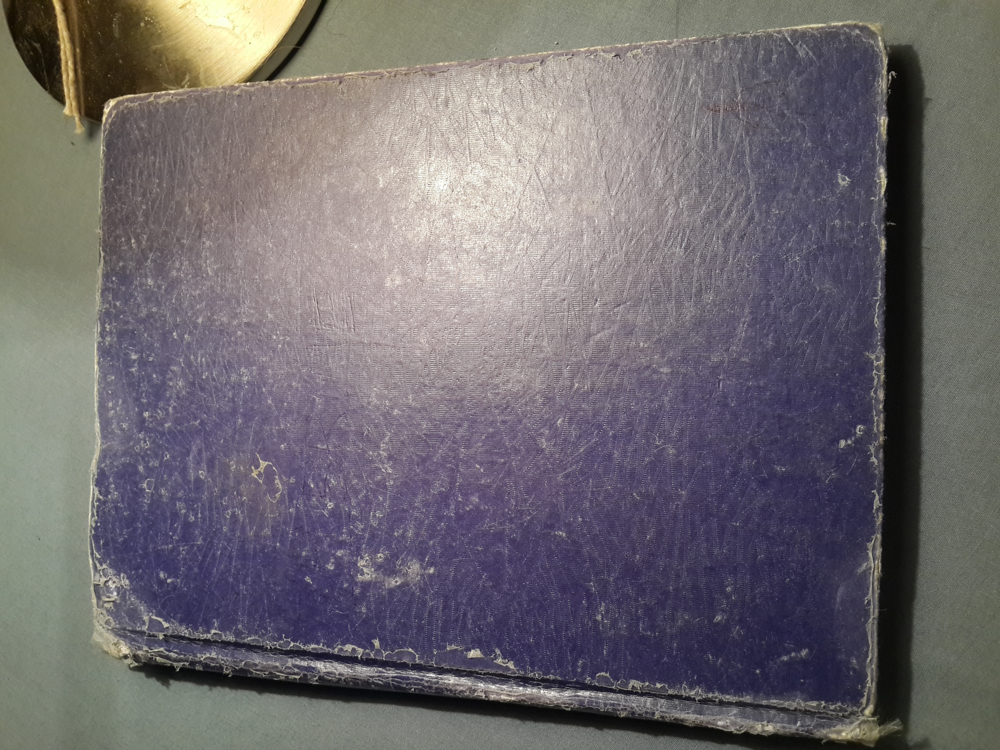

# Cuaderno viajero

En 2011, 2012 y 2013, compartimos viajes de vacaciones el mismo grupo los tres años: el Almirante Donghi, Sabri, El Rey, PEDRI, Fla y Pika.

En el segundo de esos viajes llevamos un cuaderno para escribir huevadas. Y huevadas escribimos.

En 2014, cuando Sabri se fue de viaje más largo, se llevó el cuaderno de gira. Pero antes llegué a sacarle unas fotos a los textos, para preservarlos.

Apenas 10 añitos tardé en transcribirlos.

Acá están.

